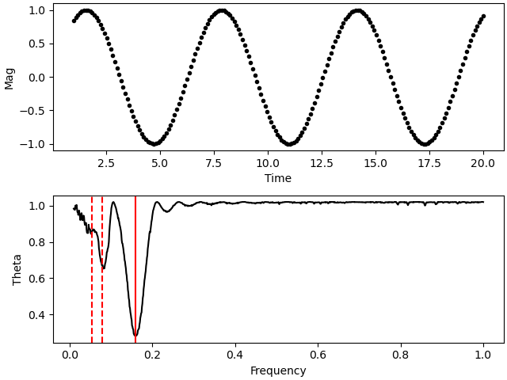

Introduction
============

``Py-PDM`` is Aa Python wrapper of the Phase Dispersion Minimization (PDM), which is a C code written by `Stellingwerf <https://www.stellingwerf.com/rfs-bin/index.cgi?action=PageView&id=34>`__.

Compared with other Python implementations, with the help of Cython, we can obtain a much faster PDM tool.

As an example, we can create a sinsoidal tiem series with period = :math:`2\pi`:

.. code-block:: python

    >>> import numpy
    >>> t = np.linspace(0, 20, 101)
    >>> y = np.sin(t)

Then we can calculate the PDM with ``Py-PDM``

.. code-block:: python

   >>> from pdmpy import pdm
   >>> freq, theta = pdm(t, y, f_min=0.01, f_max=1, delf=1e-3)
   >>> print(f'Period is {1 / freq[np.argmin(theta)]:.3f}')
   # Period is 6.289

You can also plot the freq vs theta to find the minima.

.. code-block:: python

    >>> import matplotlib.pyplot as plt
    >>> fig, (ax1, ax2) = plt.subplots(2, 1, constrained_layout=True)
    >>> ax1.plot(t, y, 'k.')
    >>> ax1.set_xlabel('Time')
    >>> ax1.set_ylabel('Mag')
    >>> ax2.plot(freq, theta, 'k')
    >>> ax2.axvline(1/2/np.pi, color='red')
    >>> for i in range(2,4):
    >>>     ax2.axvline(1/2/i/np.pi, color='red', ls='--')
    >>> ax2.set_xlabel('Frequency')
    >>> ax2.set_ylabel('Theta')

